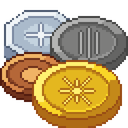

# Obol



Hytale economy plugin. Every player has a balance made of four coin
denominations, held as one number, and other plugins get a public API to
give, take, transfer and display coins — for their own players, shops,
merchants or guild banks.

| Coin | Symbol | Worth |
|---|---|---|
| Copper | `c` | 1 |
| Silver | `s` | 100 copper |
| Gold | `g` | 100 silver |
| Mythril | `m` | 100 gold |

The four coins are only ways to write and display an amount: a balance is a
single `long` in copper, and `2g 35s 4c` is `20 354` copper. Balances never
go negative; a withdrawal that cannot be covered is refused, nothing else.

## Using the API from another plugin

Compile against `obol-api` (JDK-only, no server types) and declare the
manifest dependency so the server loads Obol first:

```kotlin
dependencies {
    compileOnly("dev.galysso.obol:obol-api:0.1.0")
}
```

```json
"Dependencies": { "Galysso:obol": ">=0.1.0" }
```

`obol-api` is not on a public repository yet: run
`./gradlew :api:publishToMavenLocal` from this repository and add
`mavenLocal()` to your repositories. At runtime the classes come from Obol's
own jar — never bundle them.

A player's wallet is a `PlayerWallet` on their UUID. Nothing is cached in it:
it is a handle on the balance, safe to create anywhere, any number of times.

```java
import dev.galysso.obol.api.*;

Wallet buyer = new PlayerWallet(player.getUuid());
Coins price = Coins.of(Denomination.GOLD, 2);
if (!buyer.withdraw(price)) {
    player.sendMessage(Message.raw("Not enough coins: " + buyer.balance() + " / " + price));
    return;
}
giveItem(player);
player.sendMessage(Message.raw("Balance: " + buyer.balance()));
```

What a `Wallet` can do:

| Method | Behaviour |
|---|---|
| `balance()` | Current amount. |
| `canAfford(coins)` | Read-only check; prefer the boolean of `withdraw`, which is atomic. |
| `deposit(coins)` | Adds; returns the new balance. |
| `withdraw(coins)` | Removes, or returns `false` and changes nothing. |
| `transferTo(wallet, coins)` | Moves money between any two wallets, all or nothing; `false` if the source cannot cover it. |

Every operation runs under a lock Obol keeps per wallet, so concurrent
callers never see a torn read-modify-write, and transfers cannot deadlock.

Amounts are `Coins`, a value type: `Coins.of(Denomination.SILVER, 50)`,
`Coins.of(mythril, gold, silver, copper)`, `Coins.ofCopper(20_354)`, with
`plus`, `minus` (empty below zero), `times`, `covers` and `breakdown()`.
`CoinsFormat.STANDARD` renders `2g 35s 4c` (also `toString()`),
`CoinsFormat.LONG` renders `2 gold, 35 silver, 4 copper`, and
`CoinsFormat.parse("2g 50s")` reads what a player typed.

For an optional integration, put Obol under `OptionalDependencies` and use
`ObolApi.find()` (an `Optional`) instead of `ObolApi.get()`.

## Giving something else a wallet

Anything can hold coins by extending `Wallet`. All the rules (non-negative
balance, atomicity, transfers, events) are implemented once in `Wallet` and
are `final`; a subclass only says *where* its single storage variable lives.
Two levels of commitment:

```java
// Storage managed by Obol: three lines. The balance lives in Obol's
// balances.json under "guild:<id>", persisted and locked like a player's.
final class GuildWallet extends StoredWallet {
    private final String guildId;

    GuildWallet(String guildId) { this.guildId = guildId; }

    @Override public WalletId id() { return new WalletId("guild", guildId); }
}

// Storage with the owning object: the balance lives in a persistent ECS
// component, or in the plugin's own file, and travels with it.
final class MerchantWallet extends Wallet {
    private final MerchantComponent component;   // holds a `long copper`

    MerchantWallet(MerchantComponent component) { this.component = component; }

    @Override public WalletId id()              { return new WalletId("merchant", component.merchantId()); }
    @Override protected long loadCopper()       { return component.copper(); }
    @Override protected void saveCopper(long c) { component.setCopper(c); }
}
```

A `WalletId` is a `kind` (your plugin's own namespace, e.g. `"guild"`) and a
`key`, both `[a-z0-9_-]+`; Obol's players use `"player"`. The hooks are
called under the wallet lock, on the thread that moves the money: whatever
they touch must be safe to read and write from there. A `StoredWallet` entry
is never removed on its own; call `ObolApi.get().balances().delete(id)` when
the owner is gone for good.

Either way the wallet is a first-class citizen: `/pay`-style transfers,
displays and listeners work the same whatever the storage.

## Showing coins on screen

`CoinsDisplay` puts an amount on a player's screen as a HUD overlay, without
the caller touching the server's UI system:

```java
CoinsDisplay display = ObolApi.get().display();

// Follows the player's balance, top right, until hide(): every deposit,
// transfer or admin command is reflected, whoever made it.
CoinsOverlay hud = display.track(playerId, ScreenPosition.topRight(20, 20),
                                 new PlayerWallet(playerId), CoinsFormat.STANDARD);

// Or a fixed amount (a price), changed by hand.
CoinsOverlay price = display.show(playerId, ScreenPosition.bottomLeft(20, 80),
                                  Coins.of(Denomination.GOLD, 2), CoinsFormat.STANDARD);
price.update(Coins.of(Denomination.GOLD, 3));
price.move(ScreenPosition.bottomRight(20, 80));
price.hide();
```

`ScreenPosition` is a corner plus offsets in pixels. The viewer must be
connected and in a world (`IllegalArgumentException` otherwise). Only
`CoinsFormat.STANDARD` has an on-screen template in this version: a pill
showing each count next to its coin icon, the way fixed-base currencies are
shown in games (`1g 5s 3c`): tiers above the largest one with coins are
omitted, every tier below it is shown even at zero, and each count sits
right-aligned in a column sized for two digits — `2 [gold] 5 [silver]
4 [copper]` for `2g 5s 4c`, `1 [gold] 0 [silver] 5 [copper]` for `1g 5c`. The
pill therefore only changes shape when the leading tier changes. The icons ship in Obol's asset pack; the client fetches them from
the server like any other `Common/` asset.

Overlays belong to the player's session: they vanish on disconnect and are
not put back on reconnect. A plugin that wants a permanent overlay creates it
again on the server's `PlayerReadyEvent`. Every `CoinsOverlay` method may be
called from any thread.

## Listening to changes

```java
ObolApi.get().addListener(event -> {
    // event.wallet(), event.before(), event.after(), event.increased()
});
```

Listeners run synchronously on the thread that moved the money, after the
wallet lock was released, for every wallet whatever its storage, and never
without a change. Keep them short; an exception is logged and does not reach
the code that moved the money.

## Commands and permissions

| Command | Who | Effect |
|---|---|---|
| `/balance` | any player | Shows your balance. |
| `/balance hud on\|off` | any player | Shows or hides your balance top right. The choice is remembered across sessions and restarts. |
| `/pay <player> <amount>` | any player | Sends coins to an online player, e.g. `/pay Bob 2g 50s`. |
| `/obol give <player> <amount>` | `obol.admin` | Adds coins. `<player>` is an online name or a UUID. |
| `/obol take <player> <amount>` | `obol.admin` | Removes coins; refused if the balance cannot cover it. |
| `/obol set <player> <amount>` | `obol.admin` | Sets the balance; zero is allowed. |

Amounts are written like `2g 35s 4c` (or `2g35s`, `250s`, a bare number in
copper), tiers in any order, each at most once.

Balances (and the HUD preference) live in the plugin's data directory,
`mods/Galysso_obol/balances.json`, written every 30 seconds when something
changed, on every player disconnect and at shutdown; the server keeps the
previous version as `balances.json.bak`. A file Obol cannot read stops the
plugin — and any plugin depending on it — rather than starting an empty
economy.

## API compatibility

`api` is versioned independently of the implementation and follows semantic
versioning. Within a major version:

- interfaces in `dev.galysso.obol.api` gain methods only with a `default`
  body;
- `dev.galysso.obol.api.internal` is not API and may change at any time.

## Development

| Module | Gradle plugin | Role |
|---|---|---|
| `api` | `java-library` | Public API. Published standalone as `dev.galysso.obol:obol-api`. |
| `core` | `com.azuredoom.hytale-tools` | Implementation, entry point, `manifest.json`. Ships one jar containing `api`. |

The root project applies `com.azuredoom.hytale-workspace`, which orchestrates
the workspace and propagates `hytaleVersion` / `patchline` / `manifestGroup`.

### Why `api` has no Hytale dependency

`api` compiles against the JDK alone — a player is a `UUID`, an amount is a
record, events are plain records, and subscription goes through
`CoinsListener` rather than the server event bus. Two consequences:

- The API does not break when a Hytale server upgrade changes a signature,
  and consumers do not inherit compile-time coupling to a server version.
- Anything that genuinely needs a server type (the HUD, entity components)
  belongs in `core`, behind an API-level abstraction — that is how
  `CoinsDisplay` is implemented.

It is also why the money rules are unit-tested: `Coins`, `CoinsFormat` and
`Wallet` run under JUnit with an in-memory runtime, no server in the loop;
`core` does the same for everything JDK-pure (locks, store, persistence,
overlay logic behind a fake screen).

The Hytale server jar is injected on `compileOnly` by `hytale-tools`, which is
only applied to `core`. `core`'s `jar` task copies `api`'s class output
explicitly: `hytale-tools` does not shade `project()` dependencies, so without
it the shipped plugin would be missing every API class at runtime.

### Building and running

Requires **JDK 25** — the Hytale Gradle plugin itself runs on it, so the
Gradle daemon must too, not just the compiler.
`gradle/gradle-daemon-jvm.properties` pins that requirement and Gradle
provisions a JDK 25 on first run, so a system JDK 21 on `PATH` is fine and
CI needs no setup step.

```bash
./gradlew setupHytaleDev      # first-time setup (fetches assets, prepares IDE sources)
./gradlew build               # compiles both modules, runs the tests, produces core/build/libs/Obol-<version>.jar
./gradlew runServer           # local dev server in core/run/
./gradlew updateAllPluginManifests   # regenerate core/src/main/resources/manifest.json
```

Hot-swap debugging wants a JetBrains Runtime specifically:

```bash
JAVA_HOME=~/.local/share/JetBrains/Toolbox/apps/intellij-idea/jbr \
  ./gradlew runServer -Ddebug=true -Dhotswap=true
```

Identity and versions live in `gradle.properties`; `manifest.json` is
generated from it, so edit the properties rather than the manifest.

### Hytale assets

`setupHytaleDev` needs the game's `Assets.zip`. By default it runs an OAuth
**device flow**: it prints a URL and a code and blocks until you approve them
in a browser, then times out. Two ways through it:

- approve it — run the task in an interactive terminal, open the printed URL,
  sign in with the Hytale account that owns the game;
- skip it — point the build at an existing installation. Put the path in
  `~/.gradle/gradle.properties` (never in the repo, it is machine-specific):

  ```properties
  hytaleHomeOverride = /path/to/Hytale/install/release/package/game/latest/Assets.zip
  ```

  With the Flatpak launcher that path is under
  `~/.var/app/com.hypixel.HytaleLauncher/data/Hytale/install/...`.

### Asset pack

`core/src/main/resources` is also the plugin's asset pack (`includes_pack =
true`, `IncludesAssetPack` in the manifest): it is laid out like the game's
`Assets.zip`, so the HUD documents and coin images live in
`Common/UI/Custom/Obol/`. Each tier has a `<Tier>.ui` and a `<Tier>.png`,
named after `Denomination`; the HUD appends one document per non-zero tier
into an inline root, which is how the image path stays relative to a real
file. Image paths in a `.ui` resolve relative to that file. The originals
(64×64 pixel art, plus a 256px mod icon in `docs/`) are in `tmp/`; the shipped
copies are cropped to 48×48 so that the 24px on-screen box is an exact 2:1
downscale.

### Dev server caveat

`hytale-tools` links `core/run/mods/Galysso_obol` to `core/src/main/resources`,
so the dev server reads the pack live, and its `balances.json` lands in the
sources. That file is excluded from the jar and git-ignored; delete it to
reset the dev economy.

### Smoke test in game

Give yourself `obol.admin` (`core/run/permissions.json`,
`users.<uuid>.groups = ["hytale:Admin"]`), then `/obol give <you> 2g`,
`/balance`, restart the server, `/balance` again. `/balance hud on` then
`/obol give` should update the overlay without any further command; `/pay`
between two clients checks transfers.
