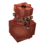

# Obol Purse

A purse for [Obol](../../README.md): a craftable item that carries coins.
Fill it from your balance, drop it, chest it, lose it, hand it to someone.
The purse is never used up.

- **Craft it** from 2 light hides and 2 fibre, in the pocket crafting menu (Tools) or at the workbench (Survival).
- **Right-click** with it in hand: your balance on the left, the purse on
  the right, one row per coin on each side with buttons that send 1 or 10
  of that coin across, and two more that move everything.
- **Right-click a player** with a full purse: "Hand over to X?", the coins,
  Yes / No. Yes makes an offer: they see "<you> offers you", the same
  coins, "Accept / Decline"
  and you wait, with Cancel. Accept credits their balance, the purse stays
  in your hand, empty. Nobody receives coins without saying yes. An offer
  expires after 30 seconds, and a declined giver waits as long before
  offering again to the same player.
- **It shows what it holds.** An empty purse is flat with a dark cord. A
  purse with coins in it is round, its cord takes the colour of the
  largest coin inside, copper to mythril, and so do the frame of its
  inventory slot and of its tooltip, its label ("Gold") and its glow on
  the ground, where a few coins of that metal drift up from it (a mythril
  purse glimmers a little). The tooltip gives the exact amount. An empty
  purse stacks with the others.

Requires Obol 0.2 or later. Drop `ObolPurse-<version>.jar` next to Obol's
jar in the server's `mods/` folder.

## Server owners

`mods/Galysso_obol-purse/purse.json`, written with its defaults on first
start:

| Key | Default | Effect |
|---|---|---|
| `DirectGive` | `true` | Right-clicking a player offers to hand the content over. Off, coins only change hands through the item itself. |
| `OfferTimeoutSeconds` | `30` | How long the receiver has to answer (at least 5), and how long a declined giver waits before offering again to the same player. |

Admins (`obol.purse.debug`, given to `hytale:Admin` by default) have a
testing aid on the purse in hand: `/purse put <amount>`,
`/purse take [amount]` (everything when left out), `/purse open`.

## How it works

A purse is a key, not the money. The coins live in Obol's store under a
wallet `purse:<uuid>`, and the item only carries that key. Filling,
emptying and handing over are transfers between Obol wallets, with Obol's
locks, persistence and HUD feed. A cloned stack opens the same wallet, so
no copy ever doubles the coins. A purse destroyed with coins in it leaves
its entry in `balances.json`, a few bytes for money that is lost anyway.
Every amount on screen, in the page and in the popups, is drawn by Obol's
`ObolUi`: the add-on never draws a coin itself.

`dev.galysso.obol.purse.api.PurseItem` is the way another add-on reads or
writes a purse (item id and its states, wallet id in the metadata,
tooltip).

## Building

`./gradlew :addons:purse:build` makes `build/libs/ObolPurse-<version>.jar`.
`./gradlew :addons:purse:runServer` starts a server in `addons/purse/run/`
with Obol and the purse, the asset pack read live from
`src/main/resources`. `./gradlew runAllMods`, from the root, runs the whole
workspace in one server.

The item, its states, models, textures and icons are generated by
`tmp/purse.py` (Pillow only), the halos on the ground by `tmp/halos.py`
(the coin images as particles), the four qualities and their slot and
tooltip frames by `tmp/qualities.py` (vanilla qualities recoloured): edit
the scripts, not the files.
