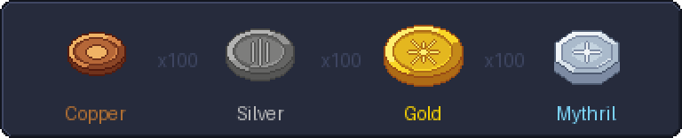

# Obol on CurseForge

The project page's text, kept here so it evolves with the mod. Paste the
part under the rule into the description editor (Markdown mode). The
summary and categories go in the project settings. The images are
generated: `python3 tools/curseforge.py docs/icon.png` for the logo,
`python3 tools/coins_strip.py` for the coins. Upload `docs/coins.png` in
the editor (or serve it from the repository) and put its URL in the
image line.

**Title:** Obol

**Summary (236/256):** Minimalist RPG-style currency and economy core for
Hytale: four coins, a balance per player, and nothing you didn't ask for.
Built to be extended: purses, lootbags, trades, shops and compatibility
with other mods are add-ons you pick à la carte.

**Categories:** Library (primary), Gameplay, Utility.

---

## What is Obol?

A currency for Hytale, and only that. Every player has a balance in four
coins, copper to mythril, shown top right of the screen.

Obol is the base other mods build on: you pick add-ons à la carte. The
API is kept small (nonetheless complete) so that writing an add-on is
easy.



## Add-ons

By me:

- **Obol Purse**: a craftable purse that carries coins and hands them over face to face.
- **Obol Lootbag**: bags of coins found in chests and on creatures, in the game's five rarities.
- **Obol Trade**: trade items and coins with the player in front of you.

By others:

- none yet, yours goes here.

## Server owners

Drop the jar into `mods/`, nothing to configure. Admins have `/obol give`,
`take`, `set` and `transfer`, with amounts like `2g 35s 4c`. Balances are
in `mods/Galysso_obol/balances.json`.

## Modders

```java
Wallet buyer = Obol.playerWallet(player.getUuid());
if (!buyer.withdraw(Coins.parse("2g"))) return;   // atomic, false means nothing moved
ObolUi.show(commands, "#Price", price);           // coins drawn in your own page
```

Any wallet you name, transfers that move both sides or neither, coins
drawn for you. [README](https://github.com/galysso/obol#modders) for the
setup and reference, [MODDING.md](https://github.com/galysso/obol/blob/main/MODDING.md)
for the patterns. MIT.
